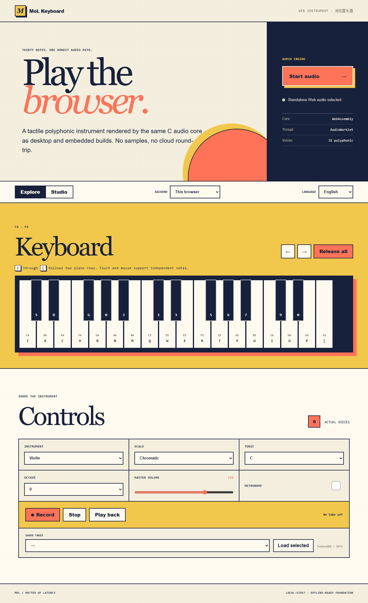

# MoL Keyboard · 张多少的键盘

MoL Keyboard (More or Less Zhang's Keyboard) is a lightweight, embeddable,
headless-capable digital instrument system. It turns physical keyboards,
touch, MIDI, GPIO, and programmatic input into real-time performance,
recording, and playback through one portable music engine.

MoL Keyboard（张多少的键盘，英文全称 More or Less Zhang's Keyboard）是一套轻量、
可嵌入、可无界面运行的数字乐器系统。它使用同一个可移植音乐引擎，把物理键盘、触摸、
MIDI、GPIO 和程序事件统一转换为实时演奏、录制与回放。

This repository is a clean-room implementation started from a blank project.
It does not contain code or assets from an earlier MoL Keyboard project.

本仓库是从空白项目开始的全新实现，不包含任何旧版 MoL Keyboard 的代码或资源。

## Current status / 当前状态

The portable core, music/DSP, recording/tooling, desktop, Web/PWA, Android,
iOS, HarmonyOS, and ESP32 implementations are present. Native, Wasm, Android
emulator, and all four ESP-IDF builds have current evidence; Apple, DevEco,
physical mobile/ESP32 hardware, Safari, and measured end-to-end latency remain
release blockers. This repository is therefore a 0.1.0 prerelease and is not
tagged v1.0.0. Platform claims are recorded only after real builds or runtime checks. See
[`docs/status/IMPLEMENTATION_STATUS.md`](docs/status/IMPLEMENTATION_STATUS.md)
and [`docs/status/PLATFORM_MATRIX.md`](docs/status/PLATFORM_MATRIX.md) for current
evidence.

可移植核心、音乐与 DSP、录音工具、桌面、Web/PWA、Android、iOS、HarmonyOS 和
ESP32 实现均已落地。Native、Wasm、Android 模拟器及四个 ESP-IDF 构建已有当前证据；
Apple、DevEco、移动与 ESP32 真机、Safari 以及真实端到端延迟仍是发布门禁。因此当前版本
仍为 0.1.0 预发布版，不标记为 v1.0.0。平台支持只在真实构建或运行验证后声明。

## Quick start / 快速开始

The initial native workflow uses CMake, Ninja, and CTest:

```powershell
cmake --preset dev-debug
cmake --build --preset dev-debug
ctest --preset dev-debug
```

On Windows, run these commands from a Visual Studio developer shell and ensure
Ninja is on `PATH`. Linux uses the same presets with GCC or Clang.

Windows 用户需在 Visual Studio 开发者终端中运行，并确保 `PATH` 中包含 Ninja；Linux
可用同一组预设配合 GCC 或 Clang。

Render the included sequence to a deterministic 24-bit mono WAV without an audio device:

```powershell
build/dev-release/apps/mol-render/mol-render examples/sequences/scale-study.molseq `
  --output scale-study.wav --format pcm24 --channels 1 --report scale-study.json
```

无需音频设备即可用上述命令将示例序列确定性地渲染为 24-bit 单声道 WAV，并生成含统计与
SHA-256 的 JSON 报告。

Inspect, validate, convert, or edit Mol Sequence v1 files with `mol-seq`:

```powershell
build/dev-release/apps/mol-seq/mol-seq inspect examples/sequences/scale-study.molseq
build/dev-release/apps/mol-seq/mol-seq binary-to-json input.molseq output.molseq.json
build/dev-release/apps/mol-seq/mol-seq midi-export input.molseq output.mid
```

List desktop outputs or play the same C4 through the system default device:

```powershell
build/dev-release/apps/mol-play/mol-play --list-devices
build/dev-release/apps/mol-play/mol-play --duration 2 --note 60
```

上述命令可列出桌面输出设备，或通过系统默认设备实时播放同一个 C4；蓝牙音箱由操作系统
作为普通音频设备提供，本项目不重复实现系统配对。

## Physical key map / 物理键位

The default 30-key chromatic range is C4–F6 and uses physical key codes:

```text
C4–B4: Z S X D C V G B H N J M
C5–B5: Q 2 W 3 E R 5 T 6 Y 7 U
C6–F6: I 9 O 0 P [
Sustain: Space
```

## Headless and Web use / 无界面与 Web 使用

Start the foreground desktop service and control it from another terminal:

```powershell
build/dev-release/apps/mol-keyboardd/mol-keyboardd
build/dev-release/apps/molctl/molctl status
build/dev-release/apps/molctl/molctl preset set violin
build/dev-release/apps/molctl/molctl doctor
```

`mol-keyboardd` uses local-only IPC and the operating system's audio devices;
use `--null-backend` on machines without audio hardware. The same C core also
executes in the complete offline-capable Web/PWA instrument and builds into
ESP32/ESP32-S3 firmware with a configurable I2S host. From `apps/web`, run
`npm ci` followed by `npm run build` or `npm run test:browser`.



The Android application packages the same local UI and renders exclusively
through JNI, Oboe/AAudio, and the C core. Build it with
`platforms/android/build-app.ps1 Debug` (or `build-app.sh` on POSIX hosts); see
[`platforms/android/README.md`](platforms/android/README.md) for the pinned SDK
and emulator test commands.

The iOS application packages that UI behind an offline-only
`WKURLSchemeHandler` and renders through RemoteIO, `AVAudioSession`, and the same
C core. On a Mac with Xcode and the pinned Emscripten SDK, run
`platforms/ios/build-app.sh Simulator` or `platforms/ios/build-app.sh Device`.
The device build is unsigned unless signing variables are supplied.

`mol-keyboardd` 与 `molctl` 已可在无界面模式下通过仅限本机的 IPC 完成演奏、音色切换、
录音、回放和诊断；无音频设备的机器可使用 `--null-backend`。同一份 C 核心也已在
完整的离线 Web/PWA 乐器中通过验证，并构建为带可配置 I2S 宿主的 ESP32/ESP32-S3
固件。Android 双 ABI 应用已完成构建，并在 Android 15 模拟器上通过
UI→JNI→Oboe/AAudio→C 核心及后台/锁屏生命周期验证。iOS 完整应用源码也已实现，
通过本地 WKWebView 界面连接 AudioUnit/AVAudioSession 与同一 C 核心；其 Xcode
构建和真机验收仍须在 Apple 环境中完成。

## Platform matrix / 平台矩阵

| Target / 目标 | Implementation / 实现 | Current evidence / 当前证据 |
| --- | --- | --- |
| Windows | daemon, CLI, WASAPI, Raw Input | MSVC tests and real WASAPI service run passed / 测试及真实 WASAPI 服务运行通过 |
| Linux | daemon, CLI, native audio/evdev host | GCC/Clang and WSL lifecycle passed; physical devices pending / 构建与 WSL 生命周期通过，物理设备待验 |
| macOS | daemon, CoreAudio, IOHIDManager | source present; Apple build/runtime pending / 源码已实现，Apple 构建运行待验 |
| Web/PWA | Wasm AudioWorklet, offline shell | supported-browser automation passed; Safari pending / 已支持浏览器自动化通过，Safari 待验 |
| Android | Oboe/AAudio foreground service | dual-ABI builds and Android 15 emulator passed; device pending / 双 ABI 与模拟器通过，真机待验 |
| iOS | AudioUnit, AVAudioSession, offline WKWebView | implementation present; Xcode/device pending / 实现已完成，Xcode 与真机待验 |
| HarmonyOS | OHAudio, AVSession, continuous task | source audit passed; DevEco/device pending / 源码审计通过，DevEco 与真机待验 |
| ESP32 | I2S, GPIO/BLE/Classic HID, A2DP Source | ESP-IDF image/map passed; board HIL pending / 固件与 map 通过，开发板 HIL 待验 |
| ESP32-S3 | I2S, GPIO/BLE/USB HID | ESP-IDF image/map passed; board HIL pending / 固件与 map 通过，开发板 HIL 待验 |

See the evidence-linked
[`PLATFORM_MATRIX.md`](docs/status/PLATFORM_MATRIX.md) for exact qualification
levels. 详细资格等级与证据链接见该文档。

## Builds and packages / 构建与打包

Activate the pinned Emscripten SDK before the Wasm commands:

```powershell
& .\.cache\emsdk\emsdk_env.ps1
cmake --preset wasm-release
cmake --build --preset wasm-release
ctest --preset wasm-release
npm.cmd --prefix apps\web ci
npm.cmd --prefix apps\web run build
```

激活仓库固定的 Emscripten SDK 后，可用上述命令构建并测试 Wasm 与生产 Web 包。
构建完成 Web 资源后，可生成含本地程序、C SDK、文档、示例、许可证与 SBOM 的便携包：

```powershell
cmake --preset package-release
cmake --build --preset package-release
cpack --config build/package-release/CPackConfig.cmake -B build/packages
```

Android, iOS, HarmonyOS, and ESP-IDF exact toolchain commands are documented
under `platforms` and `docs/platform`. Portable packages are unsigned; mobile
store signing credentials are intentionally external.

Android、iOS、HarmonyOS 与 ESP-IDF 的固定工具链命令见 `platforms` 和
`docs/platform`。便携包不带签名；移动商店签名凭据必须保存在仓库之外。

## Platform boundaries / 平台边界

- Desktop and mobile Bluetooth audio routing is normally owned by the OS.
- Bluetooth audio latency is measured separately from wired low-latency audio.
- Browser keyboard input requires focus, and audio startup requires a user gesture.
- Mobile background audio follows each platform's service and session rules;
  ordinary hardware keyboard input is not promised while fully backgrounded.
- ESP32-S3 has no Classic Bluetooth A2DP Source capability; original ESP32
  targets may provide it when supported by the SDK and hardware.

- 桌面与移动端蓝牙音频通常由操作系统负责配对和路由。
- 蓝牙音频延迟与有线低延迟音频分开测量。
- 浏览器键盘输入依赖页面焦点，音频启动依赖用户手势。
- 移动端后台音频遵循平台服务与会话规则，不承诺完全后台时接收普通硬件键盘输入。
- ESP32-S3 不支持经典蓝牙 A2DP Source；原始 ESP32 仅在 SDK 与硬件支持时提供。

MoL Keyboard applies conservative digital gain and limiting, but software
cannot guarantee safe acoustic sound pressure because speakers, headphones, and
system volume remain outside the engine's control.

MoL Keyboard 使用保守的数字增益与限幅，但扬声器、耳机和系统音量不受引擎完全控制，
因此软件不能保证实际声压级安全。

Current limitations include unmeasured physical end-to-end latency, unverified
Apple/DevEco builds, and missing physical mobile and ESP32 long-run evidence.
The exact remaining gates are maintained in
[`KNOWN_LIMITATIONS.md`](docs/status/KNOWN_LIMITATIONS.md) and are not hidden by
generic “cross-platform” language.

当前限制包括尚未实测的物理端到端延迟、尚未完成的 Apple/DevEco 构建，以及移动与
ESP32 真机长时间证据。准确的剩余门禁记录在上述限制文档中，不以笼统的“跨平台”表述掩盖。

## License / 许可证

First-party source code is licensed under Apache-2.0. Assets and examples must
carry their own license records. See [`LICENSE`](LICENSE) and [`NOTICE`](NOTICE).

第一方源代码使用 Apache-2.0 许可证；资源与示例必须分别记录许可证。
